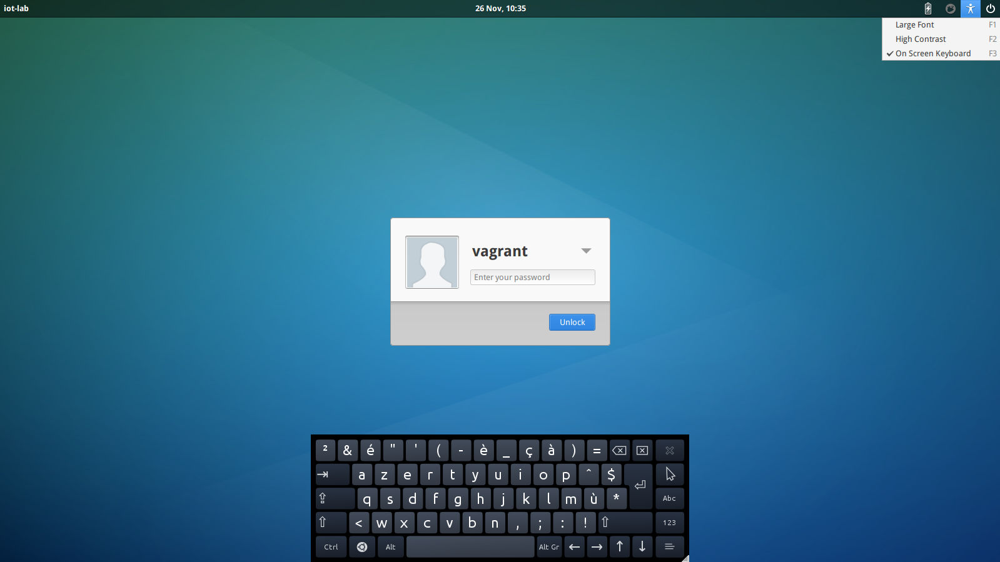

Iot-LAB virtual machine (VM)
===========================

Create a **Xubuntu 14.04 x64** VM with following features :
  * package depedencies
  * user vagrant (login=vagrant/password=vagrant)
  * git clone Iot-LAB github (in ~/vagrant/iot-lab) 
  * toolchains compilation (arm-gcc & msp430-gcc)
  * CLI Tools installation
  * Contiki tunslip binary (in ~/vagrant/tunslip6)
  * autologin
  * login screen with keyboard layout en/fr CTRL+SHIFT
  * Virtualbox guest additions

Requirements
------------

**Managing VM** : 

  * Virtualbox : https://www.virtualbox.org/wiki/Downloads (testing with 4.3.28)
  * Vagrant : https://www.vagrantup.com/downloads.html (testing with 1.7.2)
  
``` 
wget https://dl.bintray.com/mitchellh/vagrant/vagrant_1.7.2_x86_64.deb
dpkg -i vagrant_1.7.2_x86_64.deb
```

**Building VM** :

  * Packer : https://www.packer.io/downloads.html (testing with 0.7.2)

Launching VM
------------

On Linux :
```
mkdir ~/vagrant && cd ~/vagrant
vagrant init iotlab/trusty64
```

On Windows, open a dos console (cmd.exe):
```
md vagrant 
cd vagrant
vagrant init iotlab/trusty64
```

Note : iotlab/trusty64 is a public Vagrant box file on the cloud (https://vagrantcloud.com/iotlab/boxes/trusty64)

* **Without Desktop**
 - Launch VM :
 
   ```
   vagrant up
   ```
 - Connect to the VM :
 
   ```
   vagrant ssh
   ```
 - Halt the VM :
 
   ```
   vagrant halt
   ```
* **With Desktop**
 - Edit Vagrantfile in the directory vagrant and **uncomment**
   ```
    config.vm.provider "virtualbox" do |vb|
        vb.gui = true
    end
   ```
   
 - Launch VM :
 
   ```
   vagrant up
   ```

Keyboard configuration
----------------------- 

* user vagrant (login=vagrant/password=vagrant)

If you use the VM with the desktop, at the login screen, the default keyboard is english. You can switch in french keyboard with :

* keyboard layout en/fr CTRL+SHIFT.
* or use the screen keyboard see below :




Building VM
-----------

- Generate a Vagrant Iot-LAB box file

   ```
   git clone https://github.com/iot-lab/iot-lab.git
   cd iot-lab/packer-template/ubuntu-14.04
   packer build ubuntu-14-04.json
   ls ubuntu-14-04-x64-virtualbox.box
   mkdir ~/vagrant && cd ~/vagrant
   vagrant init
   vagrant box add iotlab iotlab/packer-template/ubuntu-14.04/ubuntu-14-04-x64-virtualbox.box
   vagrant box list
   ```
- Edit Vagrantfile 

  ```
  config.vm.box = "iotlab"
  ```
- Launch VM 

  ```
  vagrant up
  ```
  
  


